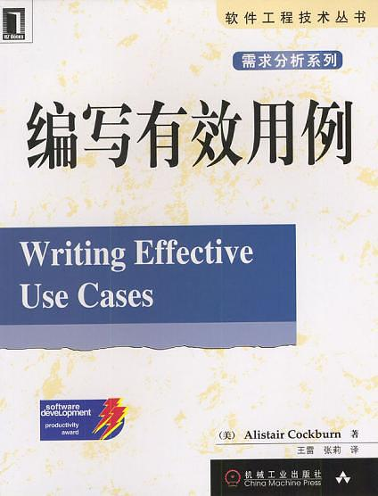

# 用例说明

[点击此行，查看 jili 用例](UseCase.md)

编写用例方法来自于

## 目标级别

| 目标等级   |    图标    |     代码     |
| ---------- | :--------: | :----------: |
| 很高的概要 |  :sunny:   |  `:sunny:`   |
| 概要       | :airplane: | `:airplane:` |
| 用户目标   |   :boat:   |   `:boat:`   |
| 子功能     |   :fish:   |   `:fish:`   |
| 细节       |  :anchor:  |  `:anchor:`  |

## 设计范围

| 设计范围 |    图标     |     代码      |
| -------- | :---------: | :-----------: |
| 系统     |  :package:  |  `:package:`  |
| 构件     | :paperclip: | `:paperclip:` |
